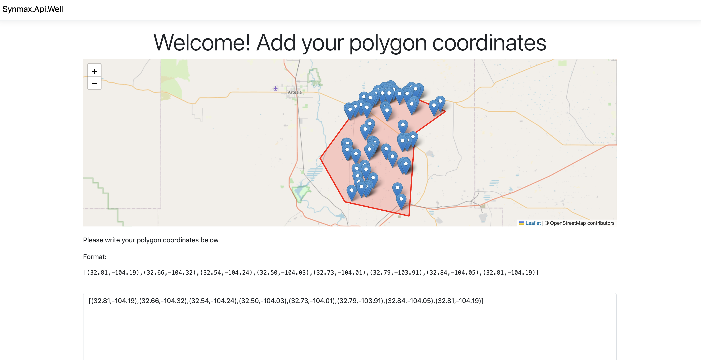

# Oil Well Data Scraper

This ASP.NET application scrapes geospatial data from the New Mexico Oil Conservation Division (OCD). It offers an API for parsing data in a JSON format and a Website for visualizing and managing oil well data through a user-friendly interface.



## Features

- **Geospatial Data Visualization**: Displays a map with polygons and points representing oil wells.
- **API Integration**: Allows interaction and data retrieval using RESTful API endpoints.
- **CSV Download**: Download search results as CSV files containing API numbers and coordinates.
- **Dynamic Map Interaction**: Utilizes Leaflet.js to render polygons dynamically based on user input.

## Visit the Site

You can access the application at [https://well-details-70ce8669931c.herokuapp.com/](https://well-details-70ce8669931c.herokuapp.com/).

## Architecture

This application follows the Model-View-Controller (MVC) design pattern:

### Program.cs

- **Dependency Injection**: Manages services such as the Swagger generator and PostgreSQL database registration.
- **Service Initialization**: Configures necessary components to run the application.

### Controllers

- **HomeController**: Handles the main homepage.
- **GeospatialController**: Manages geospatial data search using polygon coordinates.
- **WellController**: Provides detailed information based on API numbers.

### Data and Models

- **Data Folder**: Contains database context and migration files.
- **Models**: Defines data structures for coordinate polygons, well data, and search results.

### Services

- **DatabaseSeeder**: Seeds the database with initial data from a test CSV file.
- **DatabaseSeederHostedService**: Ensures seeding is complete before the application starts.
- **WellDetailsParser**: Parses data from the OCD website utilizing XPath nodes.

## Implementation Details

- **NetTopologySuite**: Used for geospatial operations and handling polygon searches.
- **PostgreSQL**: Backend database for storing scraped data.
- **Exponential Backoff**: Manages rate limiting when scraping data from the OCD website.
- **Leaflet.js**: Renders interactive maps and overlays geospatial data.

## Getting Started

### Prerequisites

- [.NET SDK](https://dotnet.microsoft.com/download)
- PostgreSQL database

### Installation

1. Clone the repository:
   ```bash
   git clone <repository-url>
   cd <repository-directory>
   ```

2. Configure the database settings in `appsettings.json`.

3. Run the application:
   ```bash
   dotnet run
   ```

## Usage

1. **Input Polygon Coordinates**: Enter polygon coordinates on the map interface.
2. **Visualize Data**: View API points and locations on the map.
3. **Download CSV**: Use the download button to obtain a CSV of the search results.

## Rate Limiting

Implemented to avoid overloading the OCD website, with single-threaded scraping for reliability.

## Contact

For questions or to discuss this project further, feel free to contact me :)
